```mermaid
graph TD
    A[🤖 AI Goals 2025] --> B[🧠 Advanced Deep Learning]
    A --> C[👁️ Computer Vision Projects]
    A --> D[🗣️ NLP & Chatbots]
    A --> E[☁️ MLOps & Cloud AI]
    A --> F[🚀 Generative AI]
    
    B --> G[TensorFlow Advanced]
    B --> H[PyTorch Lightning]
    
    C --> I[Object Detection]
    C --> J[Facial Recognition]
    
    D --> K[LLM Fine-tuning]
    D --> L[Transformer Models]
    
    E --> M[AWS SageMaker]
    E --> N[Docker ML]
    
    F --> O[GPT Integration]
    F --> P[AI Art Generation]
    
    style A fill:#ff0000,stroke:#fff,stroke-width:3px,color:#fff
    style B fill:#ff6b6b,stroke:#fff,stroke-width:2px,color:#fff
    style C fill:#4ecdc4,stroke:#fff,stroke-width:2px,color:#fff
    style D fill:#45b7d1,stroke:#fff,stroke-width:2px,color:#fff
    style E fill:#96ceb4,stroke:#fff,stroke-width:2px,color:#fff
    style F fill:#ffeaa7,stroke:#fff,stroke-width:2px,color:#000
```

<div align="center">
  
</div>

<div align="center">
  
</div>

<div align="center">
  
</div>

<div align="center">
  
  
  
  
  
</div>

<div align="center">
  
</div>

<div align="center">
  
  
  
  
  
  
</div>

## 📊 GitHub Statistics

<div align="center">
  
</div>

<div align="center">
   
  
</div>

<div align="center">
  
</div>

<div align="center">
  
</div>

<div align="center">
  
</div>

<div align="center">
  
</div>

<div align="center">
  
  
</div>

<div align="center">
  
</div>

## 🏆 GitHub Trophies

<div align="center">
  
</div>

<div align="center">
  
</div>

<div align="center">
  
</div>

<div align="center">
  
  
</div>

<div align="center">
  
</div>

<div align="center">
  
</div>

## 📈 Activity Graph

<div align="center">
  
</div>

[](https://github.com/ashutosh00710/github-readme-activity-graph)

<div align="center">
  
</div>

## 📊 Advanced Statistics

<div align="center">
  
</div>

<div align="center">
  
  
</div>

<div align="center">
  
</div>

<div align="center">
  
  
</div>

<div align="center">
  
</div>

<div align="center">
  
</div>

<div align="center">
  
</div>

## ⏰ Coding Time

<div align="center">
  
  
  
</div>

<div align="center">
  
</div>

<div align="center">
  
</div>

<div align="center">
  
  
</div>

## 🤖 Artificial Intelligence Stack

<div align="center">
  
  
  
  
  
  
</div>

### 🧠 Machine Learning & AI


### 🤖 AI Tools & Frameworks


### � Data Science & Analytics


### ☁️ Cloud & MLOps


<div align="center">
  
</div>

<div align="center">
  
</div>

## 🧠 Currently Studying AI

<div align="center">
  
  <br/>
  
  
  
  
</div>

<div align="center">
  


</div>

### 🎯 AI Projects in Development

<div align="center">
  
  
  
</div>

<div align="center">
  
</div>

<div align="center">
  
</div>

## 🌐 Connect with Me

<div align="center">
  
  
  
</div>

<div align="center">
  <a href="https://www.instagram.com/gab1elll/" target="_blank">
    
  </a>
  <a href="https://wa.me/5542998239179?text=oi" target="_blank">
    
  </a>
  <a href="https://discord.gg/C9pYHdJQvh" target="_blank">
    
  </a>
  <a href="mailto:gabriel@email.com" target="_blank">
    
  </a>
  <a href="https://linkedin.com/in/gabrielgarcia" target="_blank">
    
  </a>
</div>

<div align="center">
  
</div>

## 👨‍💻 About Me


```typescript
class DeveloperGabriel {
  name: string = "Gabriel Garcia";
  age: number = 19;
  location: string = "Brazil 🇧🇷";
  role: string = "Full Stack Developer";
  
  languages: string[] = [
    "JavaScript", "TypeScript", "Python", 
    "PHP", "HTML5", "CSS3"
  ];
  
  frameworks: string[] = [
    "React.js", "Node.js", "Express",
    "Next.js", "Bootstrap"
  ];
  
  databases: string[] = ["MySQL", "MongoDB", "PostgreSQL"];
  
  tools: string[] = [
    "VS Code", "Git", "GitHub", "Figma",
    "Docker", "Postman"
  ];
  
  currentFocus: string = "React & TypeScript";
  passion: string = "Transforming ideas into code! 🚀";
  
  getMotivation(): string {
    return "Always seeking to learn something new every day!";
  }
}

const gabriel = new DeveloperGabriel();
console.log(gabriel.getMotivation());
```

<br clear="right"/>

<div align="center">
  
</div>

## 📈 Productivity Charts

<div align="center">
  
</div>

<div align="center">
  
  
</div>

<div align="center">
  
</div>

<div align="center">
  
</div>

<div align="center">
  
</div>

<div align="center">
  
  
  
</div>

<div align="center">
  
</div>

## 🐍 Contributions

<div align="center">
  
  
  
</div>

<div align="center">
  
</div>

<div align="center">
  
</div>

## 💭 Motivational Quote

<div align="center">
  
  
  
</div>

<div align="center">
  
</div>

<div align="center">
  
</div>

## 📊 Análise de Commits

<div align="center">
  
  
</div>

<div align="center">
  
</div>

<div align="center">
  
</div>

## 🎯 Performance Metrics

<div align="center">
  
  
  
</div>

<div align="center">
  
</div>

## 🎯 2025 Goals - AI Focus

<div align="center">
  
</div>

<div align="center">
  
</div>



<div align="center">
  
</div>

<div align="center">
  
</div>

## 🔬 AI Laboratory

<div align="center">
  
  
</div>

### 🤖 Models in Development

<div align="center">

| 🧠 Projeto | 📊 Status | 🎯 Tecnologia | 🚀 Progresso |
|------------|-----------|---------------|---------------|
| **AI Chatbot** | 🟢 Ativo | GPT + Python |  |
| **Computer Vision** | 🟡 Desenvolvimento | OpenCV + TensorFlow |  |
| **Sentiment Analysis** | 🟢 Ativo | BERT + PyTorch |  |
| **Recommendation System** | 🔴 Planejando | Scikit-learn |  |
| **Speech Recognition** | 🟡 Pesquisa | Whisper API |  |

</div>

<div align="center">
  
</div>

## 🏆 AI Achievements

<div align="center">
  
</div>

<div align="center">
  
  
</div>

---

<div align="center">
  
</div>

<div align="center">
  
</div>

<div align="center">
  
### 🤖 *"Artificial intelligence is the new electricity."* - Andrew Ng

### 🧠 *"Machine Learning is the future, and the future is now!"* - Gabriel Garcia

### ⭐ Se você gostou dos meus projetos de IA, deixe uma estrela! ⭐


### 🚀 Building tomorrow with Artificial Intelligence today!

</div>

<div align="center">
  
</div>

<div align="center">
  
</div>

## 🎮 GitHub Metrics Dashboard

<div align="center">
  
</div>

<div align="center">
  
</div>

<div align="center">
  
</div>

<div align="center">
  
</div>
